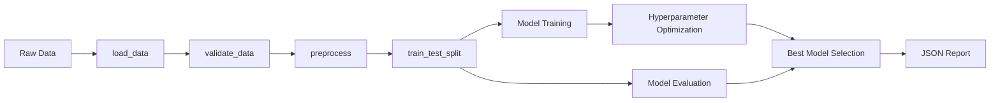

# AutoML Pipeline Optimizer

[](https://github.com/Muhtasim-Munif-Fahim/automl-pipeline-optimizer/actions/workflows/ci.yml)
[](https://www.python.org/)
[](LICENSE)
[](https://github.com/astral-sh/ruff)
[](https://mypy-lang.org/)

Automated ML pipeline with preprocessing, model selection, and hyperparameter tuning. Designed to streamline experiment workflows from raw data to evaluated models.

---

## Features

- **Automatic data preprocessing** — imputation, encoding, scaling, outlier handling
- **Multiple ML models** — 4 classifiers (logistic regression, random forest, gradient boosting, SVM) + 5 regressors
- **Hyperparameter optimization** — grid search with model-specific parameter grids
- **Comprehensive evaluation metrics** — accuracy, F1, precision, recall, ROC-AUC for classification; R², RMSE, MAE for regression
- **Feature engineering** — polynomial features, interaction terms, variance/mutual-information selection
- **JSON report generation** — structured output for all pipeline results
- **CLI interface** — run full pipelines from the command line

## Installation

```bash
# Clone the repository
git clone https://github.com/Muhtasim-Munif-Fahim/automl-pipeline-optimizer.git
cd automl-pipeline-optimizer

# Install with pip
pip install -r requirements.txt

# Or install in editable mode with dev dependencies
pip install -e ".[dev]"
```

## Quick Start

### CLI

```bash
automl-pipeline --data data.csv --target price --optimize --output results.json
```

### Python

```python
from automl_pipeline.pipeline import run_pipeline

result = run_pipeline("data.csv", target="price", optimize=True)
print(f"Best model: {result.best_model_name}")
print(f"Best score: {result.best_score:.4f}")
```

See [examples/basic_usage.py](examples/basic_usage.py) for a complete example.

## CLI Reference

| Flag | Type | Default | Description |
|------|------|---------|-------------|
| `--data` | `str` | required | Path to dataset (CSV, Parquet, JSON, Excel, Feather) |
| `--target` | `str` | required | Target column name |
| `--test-size` | `float` | 0.2 | Test split ratio |
| `--cv` | `int` | 5 | Cross-validation folds |
| `--optimize` | flag | off | Enable hyperparameter optimization |
| `--models` | `str[]` | all | Specific models to try |
| `--output` | `str` | pipeline_results.json | Output JSON path |
| `--impute` | `str` | auto | Missing value strategy (auto/mean/median) |
| `--scaling` | `str` | standard | Scaling method (standard/minmax/robust) |
| `--encoding` | `str` | auto | Encoding method (auto/onehot) |
| `--version` | flag | off | Print version |

## API

### `run_pipeline(data_path, target, ...)`

Main entry point. Returns a `PipelineResult` with best model, scores, and training time.

```python
result = run_pipeline(
    data_path="data.csv",
    target="price",
    test_size=0.2,
    random_state=42,
    cv_folds=5,
    optimize=True,
    models=["random_forest", "gradient_boosting"],
    preprocess_config={"impute_strategy": "median"},
)
```

### `PipelineResult`

| Attribute | Type | Description |
|-----------|------|-------------|
| `problem_type` | `str` | Detected problem type |
| `best_model_name` | `str` | Name of the best-performing model |
| `best_model` | `Any` | Trained best model object |
| `best_score` | `float` | Best evaluation score |
| `all_results` | `dict` | All model evaluation results |
| `training_time` | `float` | Total pipeline execution time |
| `to_dict()` | `dict` | Serialize to JSON-compatible dict |

## Architecture

```
src/automl_pipeline/
├── __init__.py          # Package metadata
├── cli.py               # CLI interface
├── config.py            # Pipeline constants and defaults
├── data.py              # Data loading, validation, splitting
├── evaluation.py        # Confusion matrix, calibration, learning curves
├── feature_selection.py # Variance threshold, mutual information
├── features.py          # Polynomial and interaction features
├── models.py            # Model definitions, training, evaluation
├── optimization.py      # Grid search hyperparameter tuning
├── persistence.py       # Model and artifact save/load
├── pipeline.py          # Pipeline orchestrator
├── preprocessing.py     # Imputation, encoding, scaling, outliers
├── report.py            # JSON and text report generation
├── robust_scaler.py     # Custom robust scaler transformer
└── target_encoder.py    # Target encoding for high-cardinality categories
```

### Pipeline Flow



## Supported Data Formats

CSV, Parquet, Feather, JSON, JSON Lines, Excel (.xls/.xlsx)

## Development

```bash
# Install dev dependencies
pip install -e ".[dev]"

# Lint
ruff check src/ tests/

# Format
ruff format src/ tests/

# Type check
mypy src/ tests/

# Test
pytest --cov=automl_pipeline --cov-report=term
```

## License

[MIT](LICENSE)

## Author

**Muhtasim Munif Fahim** — s1911024120@ru.ac.bd
